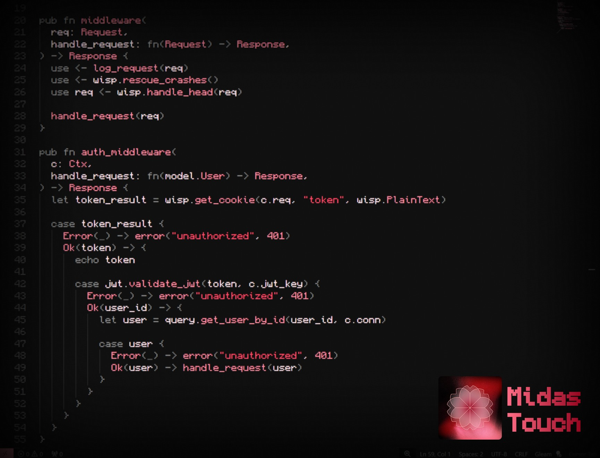

# Midas Touch

Amaranth and salmon flavored dark theme for VSCode/Cursor.

## Features

- 🤩 Accurate and easy to navigate theme's structure.
- 📝 Language-specific syntax highlighting for Gleam, Protobuf, and more.
- 🌈 Customized cozy colors for terminal, inspired by Catppuccin colors.
- 🔥 Generated with TypeScript script for easy customization and future expansion.
- 🌙 Light and dark theme variants.

## Installation

Theme is available in VSX Registry and Visual Studio Marketplace.

## Example

Check out theme from the [VS Code Themes Gallery](https://vscodethemes.com/e/vshakitskiy.midas-touch/midas-touch) for the preview with different language choices.

## Contributing

If you find any issues or have suggestions for improvements, please feel free to open an issue or submit a pull request.
